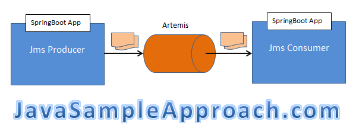
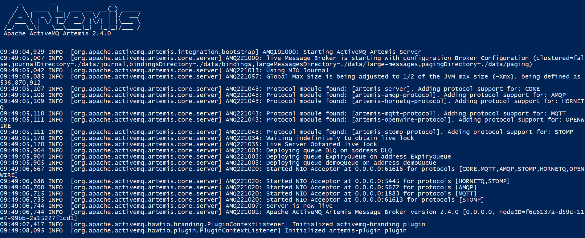

# SpringBoot Artemis Demo
A sample project to demonstrate the asynchronous communication between two spring boot apps producer and consumer through Apache ActiveMQ Artemis 2.4.0


# Introduction
Apache ActiveMQ Artemis is a combined feature-set of ActiveMQ/HornetQ/Apollo. It provides a non blocking architecture for an outstanding performance.

# Technologies
– Java 8
– Maven 3
– Spring Boot: 1.5.4.RELEASE
– Apache Artemis 2.4.0

# SpringBoot Artemis applications
In the Demo, we create 2 SpringBoot Artemis projects for producer/consumer:


**Run Artemis**

```sh
$ ${apache-artemis-home}\bin\artemis create ${apache-artemis-broker-dest}\broker1

$${apache-artemis-broker-dest}\broker1\bin\artemis run

```



**Configure artemis queue**
Go to {apache-artemis-broker-dest}\broker1\etc\broker.xml

```xml
</addresses>
<!-- .... -->
<address name="demoQueue">
    <anycast>
      <queue name="demoQueue" />
    </anycast>        
</address>
</addresses>
```


**Run the project**

```sh
$ mvn clean package
$ java -jar .\target\artemis-consumer-0.1.0.jar
$ java -jar .\target\artemis-producer-0.1.0.jar
```


**Test it**

```cmd
$ curl http://localhost:8080/produce?msg=Hello Artemis!
```
